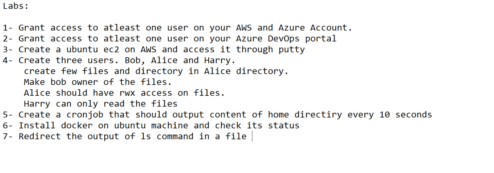
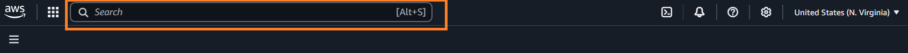
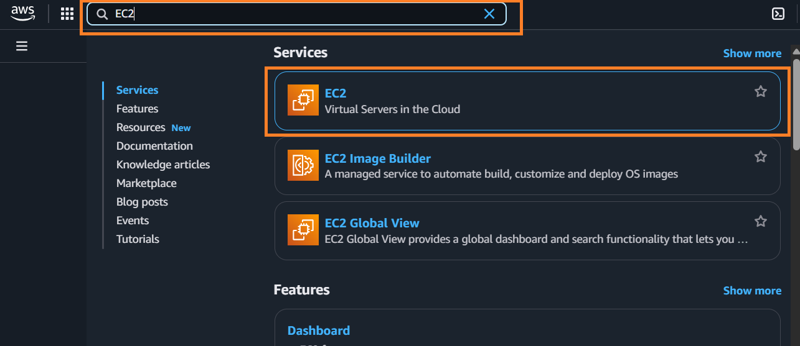
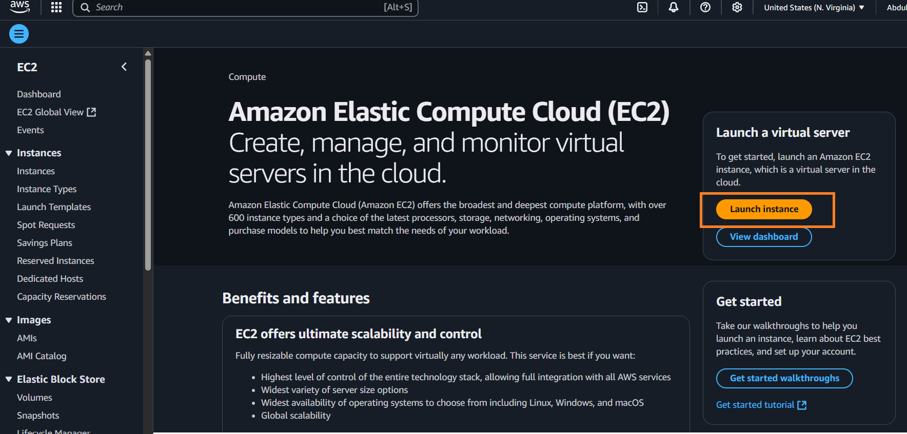
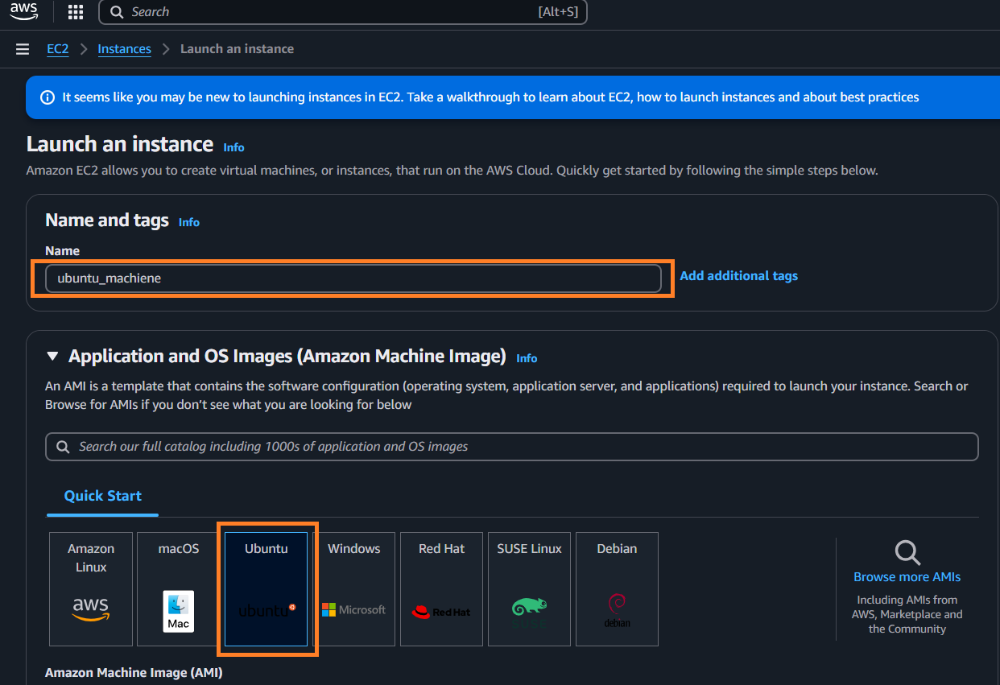
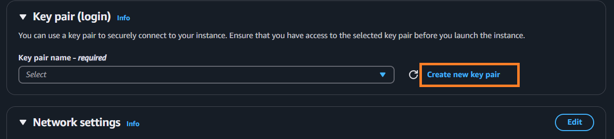
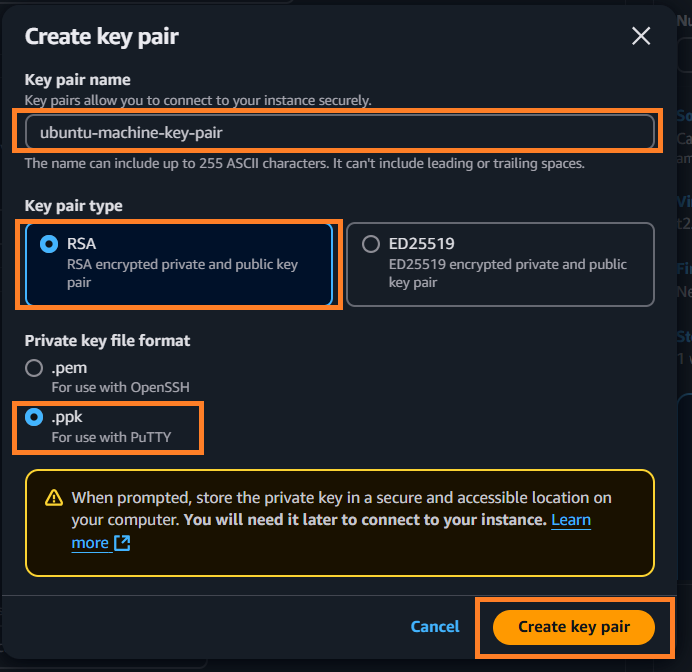

# DevOps Lab 01
This is lab 1 below.


Following are points we needed to perform.
1. Grant access to at-least one user on your AWS and Azure Account.
2. Grant access to at-least one user on your Azure DevOps portal.
3. Create a ubuntu ec2 on AWS and access it through putty.
4. Create three users. Bob, Alice and Harry.
   * Create few files and directory in Alice directory.
   * Make bob owner of the files.
   * Alice should have rwx access on files.
   * Harry can only read the files
5. Create a cronjob that should output content of home directory every 10 seconds.
6. Install docker on ubuntu machine and check its status.
7. Redirect the output of ls command in a file.

### Point 1: Grant access to at-least one user on your AWS and Azure Account.
> I don't have Azure account yet to accomplish this. If somebody can do this he can create a PR for this.


### Point 2: Grant access to at-least one user on your Azure DevOps portal.
> I don't have Azure account yet to accomplish this. If somebody can do this he can create a PR for this.

### Point 3: Create a ubuntu ec2 on AWS and access it through putty.
Here are the steps to do this.
* Create a AWS **console management** account.
  > After adding billing information, You may get an error while signing up. You can contact support of azure for that.
* On Dashboard, click the search bar.
  
* Search **_EC2_** and Select _EC2_(**Virtual Servers in cloud**). The EC2 dashboard wil be open.
  
* Click the **Launch instance** button. The Launch instance form will be shown.
  
* Enter **Name** of server and Select **Ubuntu** from _Quick Start_.
  > Name should not include any white space.
 
* Scroll a bit and click **Create new key pair** button. This will open **Create key pair** form.
  
* Enter name of key pair. Select **RSA** as Key pair type and Select **.ppk** as private file type format. After clicking the **Create Key pair** button the key will be downloaded to your pc with the name you entered and _.ppk_ extension. As you can see I entered name 'ubuntu-machine-key-pair'. File downloaded will be **ubuntu-machine-key-pair.ppk**. This file will used as _Authentication key_ in putty (I consider that you already installed the [_putty_](https://www.chiark.greenend.org.uk/~sgtatham/putty/latest.html)).
  Remember..!
> Name should not include any white space.
 
* After creating the instance do the following steps:
  * Copy the **Public IPv4 address** and paste to putty's **Host Name(or IP address)**,
  * Select **Connection type** _SSH_.
  * Port should be 22.
  * From the **Category**, open Connection > SSH > Auth > Credentials. Browse the key downloaded from system in **Private key file for authentication**.
  * Click the open button. This will open the machine locally. We just need to write the name of user (For ubuntu machine on AWS, it is most probably **ubuntu**).
  > You follow the steps from video below.  
  ><video controls src="Recording 2025-04-03 013051.mp4" title="Title"></video>

### Point 4: File Permission practice
* Create three users. Bob, Alice and Harry.
 > **User must be sudoers to create a user**.
 
 To login as a sudoers. Use command `su root` in terminal. After adding password, you will be login as root/sudoers.

 Command for creating a user in ubuntu is `adduser`. So, to create Bob, Alice, Harry, copy these in terminal
 > adduser Bob  
   adduser Alice  
   adduser Harry

 You can use `--force-badname`, if you get warning/error.
 > adduser --force-badname Bob  
  adduser --force-badname Alice  
  adduser --force-badname Harry

* Create few files and directory in Alice directory.  
  Open terminal in `/home/Alice`.
  <pre>
  touch file_1       # create a new file named _file_1_  
  
  touch file_2       # create a new file named _file_2_  
  
  touch file_3       # create a new file named _file_3_  
  
  mkdir dir_1        # create a new directory named _dir_1_  
  
  mkdir dir_2        # create a new directory named _dir_2_  
  
  mkdir dir_3        # create a new directory named _dir_3_ </pre>  
* Make Bob owner of the files.  
 Command to change the owner of file/directory is `chown`. To make **Bob** the owner of file, do copy this command in terminal.
  <pre>
    sudo chown Bob file_1       # Makes Bob the owner of _file_1_  
    sudo chown Bob file_2       # Makes Bob the owner of _file_1_  
    sudo chown Bob file_3       # Makes Bob the owner of _file_1_  
    sudo chown Bob dir_1        # Makes Bob the owner of _dir_1_  
    sudo chown Bob dir_2        # Makes Bob the owner of _dir_2_  
    sudo chown Bob dir_3        # Makes Bob the owner of _dir_3_  
  </pre>
* Alice should have rwx access on files.  
  As Bob is owner of files he has rwx access to files. One way to make rwx access to files Alice to make him owner but there can be only owner of file.As we make Bob the owner of files so this will not work here. The other way is to Add Alice and Bob to same group and make rwx access for files to that group.
    * Create a group. Let say 'users'
        > sudo addgroup users
    * Add Alice and Bob to the users group.
        > sudo usermod -aG users Alice Bob
    * Add file to the users group (change file's group).
        <pre>
        sudo chgrp users file_1
        sudo chgrp users file_2
        sudo chgrp users file_3
        sudo chgrp users dir_1
        sudo chgrp users dir_2
        sudo chgrp users dir_3
        </pre>
    * Allow all rwx access of files for all members of group 
        <pre>
        sudo chmod g+rwx file_1
        sudo chmod g+rwx file_2
        sudo chmod g+rwx file_3
        sudo chmod g+rwx dir_1
        sudo chmod g+rwx dir_2
        sudo chmod g+rwx dir_3
        </pre>
* Harry can only read the files
  As harry is belong to other group we can use `o=r` to set read permission only.  
    <pre>
    sudo chmod o=r file_1
    sudo chmod o=r file_2
    sudo chmod o=r file_3
    sudo chmod o=r dir_1
    sudo chmod o=r dir_2
    sudo chmod o=r dir_3
    </pre>
  

### Point 5: Create a cronjob that should output content of home directory every 10 seconds  

Crontab scheduling is not in seconds. The least scheduling could * * * * * (e,g; every minute).
    We can schedule the cron job for following script to run every 1 minute and run the following program. This program run `ls /home` every 10 seconds so

 * Create the following script in a file. Let say `script.sh`.    

    ```bash
        i=0
        while [ $i -lt 6 ]; do
            ls /home
            sleep 10
            i=$(( i + 1 ))
        done

 * Create a crontab job
   > crontab -e
  This will ask you select editor. After selection a editor, you will add schedule for crontab job.
 * Add `* * * * * script.sh` for scheduling of job. Exit and save the job.

### Point 6: Install docker on ubuntu machine and check its status
> Note while running the following commands, If terminal ask you **Do you want to continue [Y\n]**. You just need to press _`Enter`_. _Don't enter Y_.

Here are the commands for docker installation.
1. Remove some conflicting packages.
    > for pkg in docker.io docker-doc docker-compose docker-compose-v2 podman-docker containerd runc; do sudo apt-get remove $pkg; done
2. Set up Docker's `apt` repository.
    ```
    # Add Docker's official GPG key:
    sudo apt-get update
    sudo apt-get install ca-certificates curl
    sudo install -m 0755 -d /etc/apt/keyrings
    sudo curl -fsSL https://download.docker.com/linux/ubuntu/gpg -o /etc/apt/keyrings/docker.asc
    sudo chmod a+r /etc/apt/keyrings/docker.asc

    # Add the repository to Apt sources:
    echo \
    "deb [arch=$(dpkg --print-architecture) signed-by=/etc/apt/keyrings/docker.asc] https://download.docker.com/linux/ubuntu \
    $(. /etc/os-release && echo "${UBUNTU_CODENAME:-$VERSION_CODENAME}") stable" | \
    sudo tee /etc/apt/sources.list.d/docker.list > /dev/null
    sudo apt-get update
3. Install the Docker packages.
    > sudo apt-get install docker-ce docker-ce-cli containerd.io docker-buildx-plugin docker-compose-plugin
4. Verify that the installation is successful by running the `hello-world` image:
    > sudo docker run hello-world
5. Check status of docker service
    > sudo systemctl status docker


### Point 7: Redirect the output of ls command in a file.

Here is the command for this.  
 > ls > file        # User must be sudoers for this. 